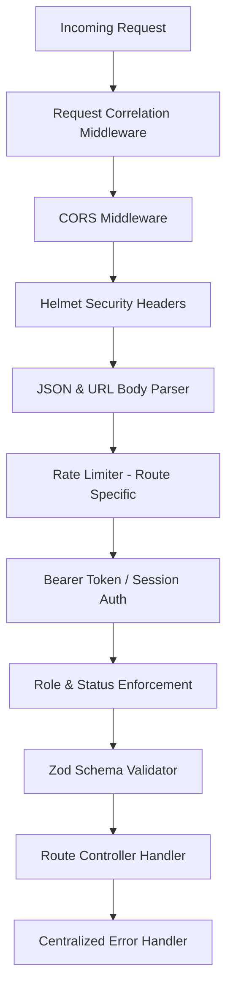

# Floria Backend REST API — Technical Specification & Architecture

## 1. Overview & Core Philosophy

The Floria API (`@floria/api`) is a standalone Node.js & Express REST API that acts as the single source of truth for the entire Floria platform (Storefront, Seller Portal, Operations Hub, Admin Dashboard, and Mobile Apps).

### Architectural Invariants & Rules
- **Server-Authoritative Pricing & Stock**: Never trust client-supplied prices, discount values, commissions, or stock quantities. All financial calculations occur server-side with integer **paise precision** (1 INR = 100 paise).
- **Multi-Seller Order Splitting**: Carts containing items from multiple nurseries are grouped into a master order and transparently split into nursery-scoped sub-orders (`fulfillment_tasks`) for isolated seller fulfillment.
- **Strict Role-Based Access Control (RBAC)**: All sensitive routes require validated bearer tokens with server-verified roles (`customer`, `seller`, `operations`, `admin`, `super_admin`).
- **Audit Logging**: Sensitive mutations (user deletion, seller approval/suspension, product moderation, financial setting changes) are captured in immutable audit logs.
- **Asynchronous Processing**: Heavy image optimizations and thumbnail generation are offloaded to BullMQ workers powered by Redis and Sharp.

---

## 2. Technology Stack & Infrastructure

| Component | Technology | Role |
| :--- | :--- | :--- |
| **Runtime** | Node.js (v20+) | Execution environment |
| **Framework** | Express 4.21 | HTTP Routing, middleware pipeline, SSE streaming |
| **Language** | TypeScript 5.6 | Strict type-safety, shared types via `@floria/types` |
| **Database** | PostgreSQL / Supabase | Relational data persistence, Row-Level Security (RLS) |
| **Queue / Cache** | Redis + BullMQ | Background media processing & rate-limiting |
| **Image Processing**| Sharp | High-performance image conversion, WebP encoding & thumbnailing |
| **Validation** | Zod 3.24 | Request payload, query, and parameter validation schemas |
| **Security** | Helmet, CORS, Rate Limiters | HTTP headers, origin protection, endpoint throttling |
| **Payment Gateway**| Cashfree Payments | Session generation, webhook verification, refunds |

---

## 3. Middleware & Security Pipeline

Requests flow sequentially through the following pipeline:



### Key Middleware
- **`requestCorrelationMiddleware`**: Generates a unique `x-correlation-id` for end-to-end request tracing.
- **`authenticateToken`**: Validates Supabase Auth JWT or standalone signed seller tokens and populates `req.user`.
- **`requireRole(...roles)` / `requireApprovedSeller`**: Enforces user role and nursery activation status.
- **`validateRequest(schema)`**: Validates `body`, `query`, and `params` against Zod schemas before reaching controllers.
- **`errorHandler`**: Catches errors, masks internal stack traces in production, and standardizes error responses.

---

## 4. API Endpoints Directory

All versioned endpoints are prefixed with `/api/v1`.

### 4.1 System & Health Checks
- `GET /` — Service status & metadata
- `GET /health` — Liveness probe (`{ status: "healthy" }`)
- `GET /ready` — Readiness probe (validates Supabase connection)

---

### 4.2 Authentication (`/api/v1/auth`)
| Method | Endpoint | Access | Description |
| :--- | :--- | :--- | :--- |
| `GET` | `/auth/me` | Authenticated | Fetches current user session profile & permissions |
| `POST` | `/auth/seller/login` | Public | Seller email/password login returning signed session |
| `POST` | `/auth/seller/register` | Public | Nursery onboarding registration & seller account creation |
| `POST` | `/auth/seller/apply` | Public | Alias for seller onboarding registration |
| `POST` | `/auth/seller/forgot-password` | Public | Initiates password reset flow |
| `POST` | `/auth/seller/reset-password` | Public | Completes password reset with reset token |

---

### 4.3 Public Catalog & Categories (`/api/v1/catalog`)
| Method | Endpoint | Access | Description |
| :--- | :--- | :--- | :--- |
| `GET` | `/catalog/products` | Public | Paginated product search with category, price & sort filters |
| `GET` | `/catalog/products/trending` | Public | Trending & best-selling plants |
| `GET` | `/catalog/products/:slug` | Public | Single product details by slug |
| `GET` | `/catalog/products/:slug/related` | Public | Related products in same category |
| `GET` | `/catalog/categories` | Public | Full category hierarchy |
| `GET` | `/catalog/categories/:slug` | Public | Category details and subcategories |
| `GET` | `/catalog/sellers` | Public | Nursery leaderboard and seller directories |
| `GET` | `/catalog/sellers/:id` | Public | Nursery profile, ratings, and active products |

---

### 4.4 Customer Shopping (`/api/v1/customer`)

#### Cart & Wishlist
| Method | Endpoint | Access | Description |
| :--- | :--- | :--- | :--- |
| `GET` | `/customer/cart` | Customer | Fetch current cart with live inventory validation |
| `POST` | `/customer/cart/items` | Customer | Add item (`productId`, `quantity`) |
| `PATCH` | `/customer/cart/items/:productId` | Customer | Update item quantity |
| `DELETE` | `/customer/cart/items/:productId` | Customer | Remove item from cart |
| `DELETE` | `/customer/cart` | Customer | Empty shopping cart |
| `POST` | `/customer/cart/merge` | Customer | Merge guest session cart on login |
| `GET` | `/customer/wishlist` | Customer | Get customer saved wishlist |
| `POST` | `/customer/wishlist/items` | Customer | Add product to wishlist |
| `DELETE` | `/customer/wishlist/items/:productId` | Customer | Remove item from wishlist |
| `POST` | `/customer/wishlist/merge` | Customer | Merge guest wishlist on login |

#### Checkout & Orders
| Method | Endpoint | Access | Description |
| :--- | :--- | :--- | :--- |
| `POST` | `/customer/checkout` | Customer | Process checkout: verifies stock, calculates paise totals, splits sub-orders, reserves inventory, creates Cashfree session or COD order |
| `GET` | `/customer/orders` | Customer | List customer order history |
| `GET` | `/customer/orders/:id` | Customer | Get order tracking & line items details |

#### User Profile & Addresses
| Method | Endpoint | Access | Description |
| :--- | :--- | :--- | :--- |
| `GET` | `/customer/users/me` | Customer | Get user profile |
| `PATCH` | `/customer/users/me` | Customer | Update name or phone |
| `DELETE` | `/customer/users/me` | Customer | Delete user account & log audit trail |
| `GET` | `/customer/users/addresses` | Customer | Get saved delivery addresses |
| `POST` | `/customer/users/addresses` | Customer | Add new delivery address |
| `PATCH` | `/customer/users/addresses/:id` | Customer | Edit address details |
| `PATCH` | `/customer/users/addresses/:id/default` | Customer | Set address as default delivery destination |
| `DELETE` | `/customer/users/addresses/:id` | Customer | Remove saved address |

---

### 4.5 Seller Portal (`/api/v1/seller`)
| Method | Endpoint | Access | Description |
| :--- | :--- | :--- | :--- |
| `GET` | `/seller/profile` | Seller | Get nursery business profile |
| `PATCH` | `/seller/profile` | Seller | Update business description, contact & address |
| `POST` | `/seller/applications` | Public / Seller | Submit onboarding application |
| `GET` | `/seller/application` | Customer / Seller | View current application status |
| `POST` | `/seller/application/resubmit` | Seller | Resubmit application after corrections |
| `GET` | `/seller/dashboard` | Seller | Performance KPIs (sales, revenue, orders) |
| `GET` | `/seller/products` | Seller | List seller's products |
| `GET` | `/seller/products/:id` | Seller | Get product details |
| `POST` | `/seller/products` | Approved Seller | Create new product listing |
| `PATCH` | `/seller/products/:id` | Approved Seller | Update product details |
| `PATCH` | `/seller/products/:id/status` | Approved Seller | Toggle product status (draft, active, inactive) |
| `DELETE` | `/seller/products/:id` | Approved Seller | Archive product listing |
| `POST` | `/seller/products/:id/images` | Approved Seller | Attach uploaded image |
| `DELETE` | `/seller/products/:id/images/:imgId`| Approved Seller | Remove image from product |
| `PATCH` | `/seller/products/:id/images/reorder`| Approved Seller | Reorder product image gallery |
| `PATCH` | `/seller/products/:id/images/:imgId/primary`| Approved Seller | Set primary product thumbnail |
| `GET` | `/seller/inventory` | Seller | Current stock levels & thresholds |
| `PATCH` | `/seller/inventory/:productId` | Approved Seller | Update inventory quantity |
| `GET` | `/seller/orders` | Seller | Nursery sub-orders |
| `GET` | `/seller/orders/:id` | Seller | Sub-order item breakdown |
| `GET` | `/seller/fulfillment` | Approved Seller | Orders requiring packing/pickup |
| `POST` | `/seller/fulfillment` | Approved Seller | Update fulfillment status (`PACKED`, `READY_FOR_PICKUP`) |
| `GET` | `/seller/earnings` | Seller | Seller revenue & fee ledger |
| `GET` | `/seller/payouts` | Seller | Payout status and settlement history |
| `GET` | `/seller/analytics` | Seller | Sales and traffic analytics |
| `GET` | `/seller/documents` | Seller | Uploaded verification documents |
| `POST` | `/seller/documents` | Seller | Upload compliance/KYC document |
| `GET` | `/seller/settings/financials` | Seller | Bank account & payout details |
| `GET` | `/seller/settings/notifications` | Seller | Notification preferences |
| `PATCH` | `/seller/settings/notifications` | Seller | Update notification preferences |

---

### 4.6 Operations Hub (`/api/v1/operations`)
| Method | Endpoint | Access | Description |
| :--- | :--- | :--- | :--- |
| `GET` | `/operations/health` | Operations / Admin | Hub system health |
| `GET` | `/operations/dashboard` | Operations / Admin | Hub overview metrics |
| `GET` | `/operations/orders` | Operations / Admin | Master order logistics tracking |
| `POST` | `/operations/orders/:id/status` | Operations / Admin | Update order logistics stage |
| `GET` | `/operations/pickups` | Operations / Admin | Scheduled nursery pickup queue |
| `POST` | `/operations/pickups/:id/status`| Operations / Admin | Update nursery pickup task |
| `GET` | `/operations/packing` | Operations / Admin | Consolidation and packing line |
| `POST` | `/operations/packing/:id/status`| Operations / Admin | Update packing task status |
| `GET` | `/operations/deliveries` | Operations / Admin | Out-for-delivery run assignments |
| `POST` | `/operations/deliveries/:id/assign` | Operations / Admin | Assign driver to delivery run |
| `POST` | `/operations/deliveries/:id/complete` | Operations / Admin | Mark delivered with Proof of Delivery (POD) |
| `GET` | `/operations/deliveries/:id/pod` | Operations / Admin | Retrieve POD metadata & signature/photo |

---

### 4.7 Admin Management (`/api/v1/admin`)
| Method | Endpoint | Access | Description |
| :--- | :--- | :--- | :--- |
| `GET` | `/admin/dashboard` | Admin | Executive summary & financial metrics |
| `GET` | `/admin/users` | Admin | User management list |
| `PATCH` | `/admin/users/:id/status` | Admin | Block or restore user account |
| `GET` | `/admin/sellers` | Admin | Full seller directory |
| `GET` | `/admin/seller-applications` | Admin | Pending nursery onboarding applications |
| `POST` | `/admin/sellers/:id/approve` | Admin | Approve seller application |
| `POST` | `/admin/sellers/:id/reject` | Admin | Reject onboarding application |
| `POST` | `/admin/sellers/:id/request-correction` | Admin | Request document corrections |
| `POST` | `/admin/sellers/:id/suspend` | Admin | Temporarily suspend seller |
| `POST` | `/admin/sellers/:id/reactivate` | Admin | Reactivate suspended seller |
| `GET` | `/admin/products` | Admin | Product catalog moderation |
| `PATCH` | `/admin/products/:id/publish` | Admin | Moderate & publish product |
| `PATCH` | `/admin/products/:id/archive` | Admin | Archive product |
| `GET` | `/admin/categories` | Admin | Category tree management |
| `POST` | `/admin/categories` | Admin | Create new plant category |
| `PATCH` | `/admin/categories/:id` | Admin | Modify category |
| `GET` | `/admin/orders` | Admin | Platform master orders |
| `GET` | `/admin/orders/:id/financial-breakdown`| Admin | Complete financial reconciliation breakdown |
| `GET` | `/admin/audit-logs` | Admin | Security audit trail logs |
| `GET` | `/admin/settings/financials` | Admin | Commission & fee configuration |
| `PATCH` | `/admin/settings/financials` | Admin | Update platform financial parameters |
| `GET` | `/admin/pricing-policies` | Admin | Versioned pricing policies list |
| `POST` | `/admin/pricing-policies` | Admin | Create draft pricing policy |
| `GET` | `/admin/pricing-policies/:id/preview` | Admin | Simulate price changes across catalog |
| `POST` | `/admin/pricing-policies/:id/recalculate` | Admin | Trigger catalog-wide price recalculation |
| `POST` | `/admin/pricing-policies/:id/activate` | Admin | Set policy as active platform default |
| `POST` | `/admin/pricing-policies/overrides` | Admin | Set manual price override on a product |

---

### 4.8 Payments & Refunds (`/api/v1/payments`)
| Method | Endpoint | Access | Description |
| :--- | :--- | :--- | :--- |
| `POST` | `/payments/webhooks/cashfree` | Public (Signature Verified) | Process Cashfree webhook (success, failure, drop) |
| `POST` | `/payments/create-session` | Customer | Create Cashfree payment order session |
| `GET` | `/payments/lookup-order` | Authenticated | Look up order status by Cashfree Order ID |
| `GET` | `/payments/:paymentId/status` | Authenticated | Check payment verification status |
| `GET` | `/payments/admin/all` | Admin / Operations | Audit log of all transactions |
| `POST` | `/payments/:paymentId/refund` | Admin / Operations | Trigger partial or full Cashfree refund |

---

### 4.9 Reviews & Ratings (`/api/v1`)
| Method | Endpoint | Access | Description |
| :--- | :--- | :--- | :--- |
| `GET` | `/catalog/products/:id/reviews` | Public | Paginated product reviews with rating breakdown |
| `GET` | `/catalog/products/:id/review-eligibility` | Customer | Verify verified purchase eligibility |
| `POST` | `/catalog/products/:id/reviews` | Customer | Submit verified purchase review |
| `POST` | `/catalog/products/:id/reviews/:rid/helpful` | Customer | Upvote review helpfulness |
| `GET` | `/customer/reviews` | Customer | List reviews submitted by current user |
| `PATCH` | `/customer/reviews/:id` | Customer | Edit customer's review |
| `GET` | `/seller/reviews` | Approved Seller | Reviews on products sold by this seller |
| `PATCH` | `/seller/reviews/:id/flag` | Approved Seller | Flag review for admin moderation |
| `GET` | `/admin/reviews` | Admin | Review moderation queue |
| `PATCH` | `/admin/reviews/:id` | Admin | Moderate, hide, or reinstate review |

---

### 4.10 Media & Assets Infrastructure (`/api/v1/media`)
| Method | Endpoint | Access | Description |
| :--- | :--- | :--- | :--- |
| `POST` | `/media/upload-session` | Authenticated | Initialize presigned chunked upload |
| `POST` | `/media/upload-direct` | Authenticated | Direct upload with automatic WebP transformation |
| `POST` | `/media/upload-session/:sessionId/complete`| Authenticated | Finalize upload and queue optimization worker |
| `GET` | `/media/upload-session/:sessionId` | Authenticated | Check processing job status |
| `PATCH` | `/media/seller-logo` | Seller | Bind processed media to nursery logo |
| `PATCH` | `/media/user-avatar` | Authenticated | Bind processed media to user profile avatar |
| `PATCH` | `/media/category-banner/:categoryId` | Admin | Bind media to category banner |
| `POST` | `/media/reviews/:reviewId/images` | Authenticated | Attach photos to product review |
| `POST` | `/media/seller-documents` | Seller | Upload compliance document |
| `GET` | `/media/seller-documents/:id/download` | Seller / Admin | Generate signed secure download URL |
| `PATCH` | `/media/nursery-banner` | Seller | Update seller store banner |

---

### 4.11 Real-Time Notifications (`/api/v1/notifications`)
| Method | Endpoint | Access | Description |
| :--- | :--- | :--- | :--- |
| `GET` | `/notifications/stream` | Authenticated | **Server-Sent Events (SSE)** continuous notification stream |
| `GET` | `/notifications` | Authenticated | Paginated in-app notification inbox |
| `GET` | `/notifications/unread-count` | Authenticated | Count of unread notifications |
| `PATCH` | `/notifications/:id/read` | Authenticated | Mark notification as read |
| `PATCH` | `/notifications/read-all` | Authenticated | Mark all notifications as read |
| `DELETE` | `/notifications/:id` | Authenticated | Dismiss/delete notification |

---

### 4.12 Public Platform Rules & Policies
| Method | Endpoint | Access | Description |
| :--- | :--- | :--- | :--- |
| `GET` | `/delivery/settings` | Public | Active delivery tiers, thresholds & base fees |
| `GET` | `/pricing/settings` | Public | Platform maintenance fee & financial parameters |
| `GET` | `/platform/policies` | Public | Combined delivery and pricing policies for checkout calculations |

---

## 5. Background Workers & Services

### 5.1 Media Optimization Worker (`BullMQ + Sharp`)
- **Queue**: `media-processing`
- **Worker**: `src/media/worker/media.worker.ts`
- **Functions**:
  - Image downscaling & aspect preservation
  - WebP conversion at 80% quality
  - Generation of standard sizes: `thumbnail` (150x150), `medium` (600x600), `large` (1200x1200)
  - Supabase Storage asset sync & URL binding

### 5.2 Pricing Recalculation Engine
- **Service**: `src/pricing/recalculation.service.ts`
- **Functions**:
  - Batched recalculation of customer selling prices across all active catalog products when admin updates commission rates, platform maintenance fees, or switches active pricing policies.

---

## 6. Development & Scripts

```bash
# Start backend in watch mode (tsx)
pnpm --filter @floria/api dev

# Run TypeScript type check
pnpm --filter @floria/api typecheck

# Run test suite
pnpm --filter @floria/api test

# Build production bundle
pnpm --filter @floria/api build

# Start production server
pnpm --filter @floria/api start
```
