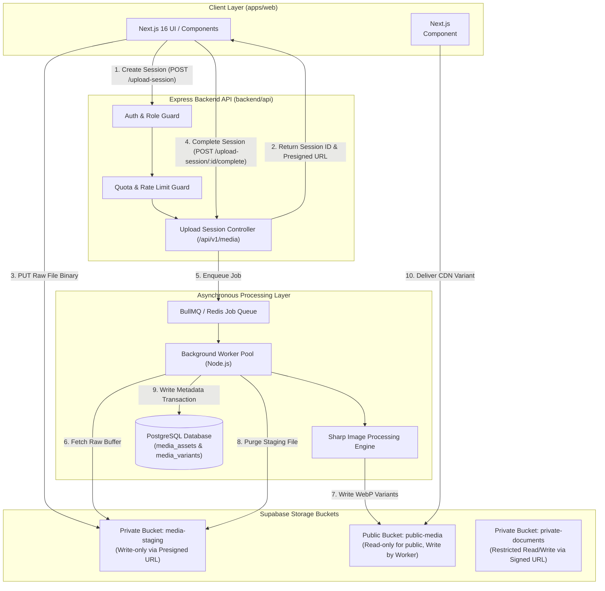

# Floria Media Infrastructure — System Architecture (V2)

## 1. High-Level System Architecture & Topology

Floria's revised media architecture is built on **presigned direct-to-staging uploads**, isolated private staging storage, worker-driven image transformations, and strict service-role write isolation for public media distribution.

---

## 2. Component Breakdown

### 2.1 Upload Session Controller (`backend/api/src/media/media-session.controller.ts`)

- **Responsibilities**:
  - Validates caller authentication and quota availability before upload begins.
  - Generates a `media_upload_sessions` record and a 15-minute presigned PUT URL targeting `media-staging/staging/{tenant_id}/{session_id}/{asset_id}.tmp`.
  - Upon completion request (`/complete`), verifies the presence of the uploaded staging file, updates session status to `COMPLETED`, creates a `media_assets` row with status `QUEUED`, and enqueues a processing job in BullMQ.

### 2.2 Async Image Worker Pool (`backend/api/src/workers/media.worker.ts`)

- **Responsibilities**:
  - Reads raw file buffer directly from `media-staging`.
  - Executes Sharp pipeline: pixel-bomb check, EXIF stripping, orientation normalization, dimension clamping, and WebP variant generation.
  - Writes processed WebP variants to `public-media` (or `private-documents` if verification document) using service-role credentials.
  - Immediately deletes raw upload file from `media-staging`.
  - Commits `media_variants` rows and updates `media_assets.status` to `READY` in an atomic PostgreSQL transaction.

### 2.3 Storage Layer (Supabase Storage Topology)

- **`media-staging` Bucket (Private)**:
  - Raw unvalidated uploads land here via client presigned PUT URLs.
  - Path: `staging/{tenant_id}/{session_id}/{asset_id}.tmp`
  - Lifecycle rule: Auto-expiring policy purges any uncompleted upload files older than 24 hours.
- **`public-media` Bucket (Public Read-Only)**:
  - Houses processed, production-ready WebP variants.
  - Path: `{domain}/{tenant_id}/{asset_id}/{variant_name}.webp`
  - **Sellers have ZERO direct write/delete permissions** on this bucket. Only system service-role background workers write here.
- **`private-documents` Bucket (Restricted Read/Write)**:
  - Houses seller GSTIN/ID documents.
  - Path: `documents/{tenant_id}/{doc_type}-{timestamp}.pdf`
  - Accessed via 15-minute temporary signed URLs generated by the API.

---

## 3. Realistic Performance & Latency Metrics

Unlike speculative sub-15ms claims, production performance metrics are grounded in real network and processing measurements:

| Flow Stage                 | Operation                                                            | Expected Metric / Latency            |
| :------------------------- | :------------------------------------------------------------------- | :----------------------------------- |
| **Session Initialization** | `POST /upload-session` (Auth, quota, presigned URL generation)       | **50 – 120 ms**                      |
| **Staging Upload**         | Client direct PUT stream to `media-staging` (2MB image over 4G/WiFi) | **150 – 600 ms** (network dependent) |
| **Completion Trigger**     | `POST /upload-session/:id/complete` (DB record & BullMQ enqueue)     | **30 – 80 ms**                       |
| **Worker Queue Wait**      | Queue wait time in BullMQ (normal load)                              | **10 – 50 ms**                       |
| **Sharp Processing**       | EXIF strip, auto-rotate, WebP generation for 3 variants (Sharp C++)  | **120 – 350 ms**                     |
| **Storage Variant Writes** | Service-role PUT of 3 WebP variants to `public-media`                | **100 – 250 ms**                     |
| **Staging Cleanup**        | Deletion of raw staging `.tmp` file                                  | **40 – 90 ms** (async)               |
| **Total End-to-End**       | From upload button tap to `READY` state notification                 | **0.6 – 1.5 seconds**                |

---

## 4. Architectural Guardrails & Concurrency Controls

1. **Upload Session Timeout**: Upload sessions expire after 15 minutes. Uncompleted staging files are auto-cleaned by storage lifecycle policies.
2. **Strict Public Bucket Lockdown**: Public media files cannot be modified or overwritten by client tokens. All variant generation is executed server-side.
3. **Decompression Bomb Protection**: Input streams exceeding `268,435,456` total pixels (16,384 x 16,384) are aborted during Sharp header decoding.
