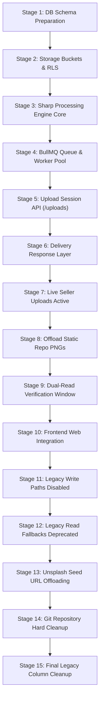

# Floria Media Phased Migration & Rollout Plan (V2)

## 1. 15-Stage Controlled Rollout Sequence

To guarantee zero downtime, non-breaking API compatibility, and verifiable data integrity, the rollout follows a strict 15-stage plan:

---

## 2. Stage Breakdown & Verification Rules

| Stage  | Name                      | Key Changes                                                                                                                           | Verification & Exit Criteria                                                              | Rollback Procedure                                                           |
| :----- | :------------------------ | :------------------------------------------------------------------------------------------------------------------------------------ | :---------------------------------------------------------------------------------------- | :--------------------------------------------------------------------------- |
| **1**  | **DB Schema Prep**        | Create `media_upload_sessions`, `media_assets`, `media_variants` tables. Add `asset_id` FK to `product_images`.                       | Run `pnpm --filter @floria/api test` (69/69 pass). Schema changes are additive.           | Drop new tables (`media_variants`, `media_assets`, `media_upload_sessions`). |
| **2**  | **Storage Buckets**       | Configure `media-staging`, `public-media`, and `private-documents` buckets with RLS rules.                                            | Public read OK on `public-media`; 403 Forbidden on direct seller write to `public-media`. | Remove storage bucket definitions.                                           |
| **3**  | **Sharp Engine**          | Add `SharpEngine` class in `backend/api/src/media/sharp.engine.ts`.                                                                   | Unit test EXIF stripping, rotation, WebP variant generation against test image fixtures.  | Remove Sharp engine module.                                                  |
| **4**  | **BullMQ Worker**         | Build `media.worker.ts` & `media.queue.ts` using Redis connection.                                                                    | Enqueue mock job; verify completion to status `READY`.                                    | Disable background worker listener.                                          |
| **5**  | **Upload Session API**    | Implement `POST /api/v1/media/uploads` and `/complete` controllers.                                                                   | Postman/Vitest: Presigned staging URL generated and session registered.                   | Revert API route registry.                                                   |
| **6**  | **Delivery Response**     | Update API JSON format to return derived `variants` payload alongside legacy `url`.                                                   | API contract test returns both `variants` object and legacy `url` string.                 | Keep legacy `url` string response as primary.                                |
| **7**  | **New Seller Uploads**    | Enable new media uploader in seller dashboard (`NurseryImageUpload` & products).                                                      | Sellers successfully upload new product images via direct-to-staging flow.                | Toggle feature flag `USE_NEW_MEDIA_UPLOADER = false`.                        |
| **8**  | **Offload Static PNGs**   | Download 10.48 MB repo assets (`nursery-1.png`, `cat-*.png`, `hero-plants.png`), process via Sharp, upload to `public-media/system/`. | Home page and nursery list render cleanly from Supabase CDN.                              | Revert public web image src paths to `/`.                                    |
| **9**  | **Dual-Read Window**      | Run system dual-read monitor for 7 days. Log any missing variant fetches.                                                             | Zero unhandled missing image errors logged in 7 consecutive days.                         | Extend dual-read fallback window.                                            |
| **10** | **Frontend Integration**  | Refactor all Next.js `<Image>` & `` tags to consume `variants.medium` / `cover`.                                                 | Build check `pnpm --filter @floria/web build` succeeds.                                   | Revert frontend component changes.                                           |
| **11** | **Disable Legacy Writes** | Block plain string `image_url` payloads in product/nursery mutation APIs.                                                             | API returns 422 if `asset_id` or upload session ID is missing in request.                 | Re-enable string URL payload handling.                                       |
| **12** | **Disable Legacy Reads**  | Remove fallback string URL parsing in backend SQL queries.                                                                            | Automated tests pass using `asset_id` references exclusively.                             | Restore fallback SQL COALESCE statements.                                    |
| **13** | **Unsplash Offloading**   | Script downloads 88 Unsplash URLs from seed scripts, runs through Image Engine, hosts on Floria CDN.                                  | Codebase `grep_search` for `images.unsplash.com` returns 0 live runtime matches.          | Restore seed script backup files.                                            |
| **14** | **Git Asset Cleanup**     | Delete offloaded PNG files from `apps/web/public/`.                                                                                   | Git repository clone size reduced by 10.48 MB.                                            | Git checkout deleted files.                                                  |
| **15** | **Final Legacy Cleanup**  | Drop legacy `url` string column from `product_images` via final migration.                                                            | DB schema clean; all product images backed by `media_assets`.                             | Restore nullable legacy column.                                              |
