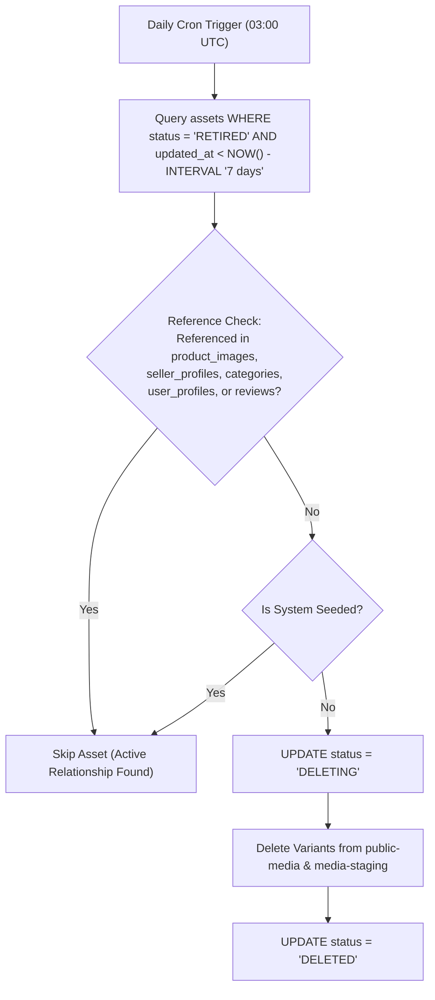

# Floria Media Operations, Observability & Scaling Architecture (V2)

## 1. Queue & Worker Topology (BullMQ + Redis)

The Express HTTP API and background image workers are deployed as separate processes:

```
┌─────────────────────────┐               ┌─────────────────────────┐
│ Express API Container   │               │ Worker Container Pool   │
│ (api.floria.in)         │               │ (worker.floria.in)      │
│ ─────────────────────── │               │ ─────────────────────── │
│ - Handles HTTP requests │               │ - Dequeues BullMQ jobs  │
│ - Upload control plane  │               │ - Executes Sharp engine │
│ - Lightweight (50MB RAM)│               │ - High CPU allocation   │
└────────────┬────────────┘               └────────────▲────────────┘
             │                                         │
             │ Enqueue Job                             │ Dequeue Job
             └───────────────┐         ┌───────────────┘
                             ▼         │
                       ┌─────────────────────┐
                       │ Redis Instance      │
                       │ (media:jobs Queue)  │
                       └─────────────────────┘
```

---

## 2. Reference-Aware Garbage Collection Cron

An automated background cron (`media-cleanup.cron.ts`) runs daily at 03:00 UTC to safely purge orphaned storage objects and retired database records:



### Staging & Failed Upload Cleanup Logic

1. **Abandoned Upload Sessions**: `media_upload_sessions` in status `CREATED` or `IN_PROGRESS` where `expires_at < NOW()` are marked `EXPIRED`. Corresponding temporary files in `media-staging` are deleted.
2. **Orphan Storage Binaries**: Storage objects in `media-staging` older than 24 hours without an active `media_upload_sessions` record are purged.
3. **Failed Processing Jobs**: Assets in status `FAILED` older than 30 days are purged from storage and database records.

---

## 3. Observability & Monitoring Specifications

Workers emit structured JSON logs adhering to Floria's request correlation architecture (`requestId`, `userId`, `sellerId`):

```json
{
  "timestamp": "2026-08-18T01:30:00.123Z",
  "level": "INFO",
  "service": "floria-media-worker",
  "requestId": "req-9a8b7c6d",
  "assetId": "asset_fa82910a-4c12-4122-b91c-99d82e11a204",
  "event": "MEDIA_PROCESSING_COMPLETE",
  "durationMs": 342,
  "inputSizeBytes": 2457600,
  "variantsGenerated": [
    { "name": "large.webp", "sizeBytes": 384102, "dimensions": "1600x1200" },
    { "name": "medium.webp", "sizeBytes": 112400, "dimensions": "800x600" },
    { "name": "thumb.webp", "sizeBytes": 18200, "dimensions": "250x250" }
  ]
}
```

### Key Performance Benchmark Targets

| Metric                      | Target Benchmark                 | Alerting Threshold                    |
| :-------------------------- | :------------------------------- | :------------------------------------ |
| **API Session Latency**     | **p95 < 100 ms**                 | Alert if p95 > 300 ms                 |
| **Worker Sharp Processing** | **p95 < 500 ms** (for 2MB input) | Alert if p95 > 1500 ms                |
| **BullMQ Queue Depth**      | **< 20 jobs**                    | Alert if depth > 100 jobs for > 5 min |
| **Upload Failure Rate**     | **< 0.5%**                       | Alert if failure rate > 2.0%          |

---

## 4. Scaling Architecture & Backpressure

- **Worker Concurrency Clamping**: Each worker container limits active Sharp jobs (`concurrency: 4`) to prevent CPU thread starvation and memory leaks.
- **Queue Backpressure**: When BullMQ queue depth exceeds 200 jobs, the Upload Session API enforces a 5-second backpressure delay on new session initialization requests to allow workers to drain the queue.
- **Independent Horizontal Scaling**: API containers scale based on HTTP request volume; worker containers scale based on CPU usage and BullMQ queue depth.
