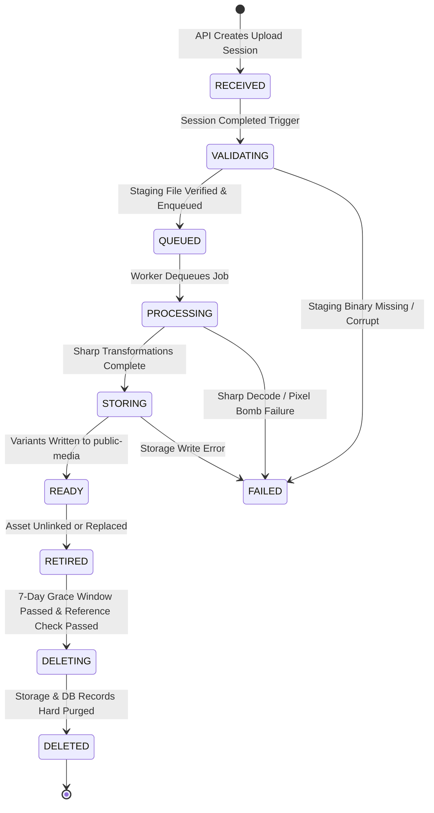

# Floria Media Upload Lifecycle & Variant Profiles (V2)

## 1. Unified State Machine & Lifecycle

All media assets follow an authoritative, single state lifecycle recorded in `media_assets.status`:



### Failure Metadata Specifications (`media_assets`)

When `status = FAILED`, the worker populates:

- **`failure_stage`**: `VALIDATION`, `PROCESSING`, `STORAGE`
- **`failure_code`**: `STAGING_BINARY_MISSING`, `INVALID_MAGIC_BYTES`, `PIXEL_BOMB_EXCEEDED`, `DECODE_ERROR`, `STORAGE_TIMEOUT`
- **`failure_message`**: Descriptive error details for debugging.

---

## 2. Variant Profile Specifications (Explicit Semantics)

Every variant profile explicitly defines target dimensions, crop/scaling behavior (`FIT`, `COVER`, `CONTAIN`), compression quality, and output format:

| Profile         | Variant Name                           | Width                  | Height                 | Max Dim                      | Crop Behavior                       | Fit Description                                                                                  | Format                   | Quality            |
| :-------------- | :------------------------------------- | :--------------------- | :--------------------- | :--------------------------- | :---------------------------------- | :----------------------------------------------------------------------------------------------- | :----------------------- | :----------------- |
| **PRODUCT**     | `large` <br> `medium` <br> `thumbnail` | 1600 <br> 800 <br> 250 | 1600 <br> 800 <br> 250 | 1600px <br> 800px <br> 250px | **FIT** <br> **FIT** <br> **COVER** | Maintain aspect ratio without cropping <br> Maintain aspect ratio <br> Center crop to 1:1 square | WebP <br> WebP <br> WebP | 82 <br> 80 <br> 75 |
| **NURSERY**     | `cover` <br> `card`                    | 1920 <br> 640          | 1080 <br> 360          | 1920px <br> 640px            | **COVER** <br> **COVER**            | 16:9 Landscape center crop <br> 16:9 Landscape center crop                                       | WebP <br> WebP           | 82 <br> 80         |
| **SELLER_LOGO** | `standard`                             | 400                    | 400                    | 400px                        | **CONTAIN**                         | Fit inside 1:1 box with transparent padding                                                      | WebP                     | 85                 |
| **USER_AVATAR** | `avatar`                               | 200                    | 200                    | 200px                        | **COVER**                           | 1:1 Square face/center crop                                                                      | WebP                     | 80                 |
| **CATEGORY**    | `banner`                               | 1200                   | 400                    | 1200px                       | **COVER**                           | 3:1 Wide landscape banner crop                                                                   | WebP                     | 82                 |
| **REVIEW**      | `display`                              | 1000                   | 1000                   | 1000px                       | **FIT**                             | Maintain customer photo aspect ratio                                                             | WebP                     | 78                 |

---

## 3. Original File Retention Policy

- **Raw Staging Binary**: Files uploaded to `media-staging` (`.tmp`) are **purged immediately** by the media worker upon successful generation and storage of WebP variants in `public-media`.
- **No Long-Term Raw Original Storage**: Floria does not retain raw uncompressed 10MB originals in production. Processed `large` / `cover` WebP variants serve as the highest resolution production source, saving up to 80% in long-term storage costs.
- **Verification Documents**: Raw PDF/JPG verification files in `private-documents` are preserved in full for compliance auditing.

---

## 4. Sharp Processing Pipeline Steps

```
[Staging File (.tmp)]
       │
       ▼
1. Header & Pixel Check (limitInputPixels: 268435456)
       │
       ▼
2. EXIF Metadata Stripping & Auto-Rotation (.rotate())
       │
       ▼
3. Variant Resizing (Sharp .resize({ fit: 'cover'|'fit'|'contain' }))
       │
       ▼
4. WebP Encoding (.webp({ quality, effort: 4 }))
       │
       ▼
5. Service-Role Storage Write to public-media
       │
       ▼
6. Delete Staging File (.tmp)
```
