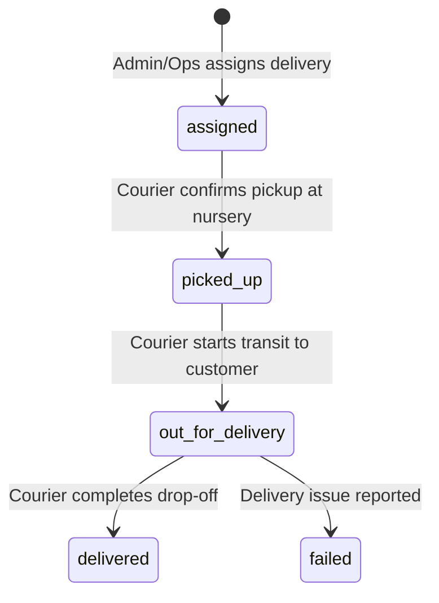

# Floria Delivery Mobile — Implementation Contract & Architecture Validation (STEP 5A.1)

> **Status:** Architecture Validated Implementation Contract
> **Source of Truth:** [`DESIGN.md`](../DESIGN.md) & [`docs/ui-ux-audit.md`](../ui-ux-audit.md)
> **Target Package:** `apps/delivery-mobile` (Expo SDK 53, React Native 0.79, TypeScript 5, Expo Router v5)
> **Stitch Design Asset Reference:** `projects/13820212217050300730` ("Floria Delivery Mobile")

---

## 1. Requirement & Architecture Classification Legend

Every requirement in this specification is categorized as:

- **[VERIFIED]:** Supported directly by existing backend code, database schema, or packages.
- **[PROPOSED]:** A product/UX design proposal that is sensible but not yet backed by database columns or server features.
- **[UNDEFINED]:** Behavior not yet defined in the codebase.
- **[INCORRECT (CORRECTED)]:** An assumption from Step 5A that contradicted the actual codebase and has been corrected.
- **[BLOCKED]:** Feature cannot execute without an upstream backend dependency.

---

## 2. API Contract & Endpoint Validation

### Authoritative Backend Route Inventory (`backend/api/src/operations/operations.routes.ts`)

| Proposed Route in Step 5A                        | Actual Backend Route                        | HTTP Method | Role Guard                           | Request Body / Query                               | Backend Implementation Status                          |
| :----------------------------------------------- | :------------------------------------------ | :---------- | :----------------------------------- | :------------------------------------------------- | :----------------------------------------------------- |
| `GET /api/v1/operations/deliveries`              | `/api/v1/operations/deliveries`             | `GET`       | `operations`, `admin`, `super_admin` | Query: `?status=...`                               | **[VERIFIED]** in `operations.controller.ts:92`        |
| `GET /api/v1/operations/deliveries/:id`          | `/api/v1/operations/deliveries/:id`         | `GET`       | `operations`, `admin`, `super_admin` | Param: `id`                                        | **[VERIFIED]** in `operations.controller.ts:102`       |
| `POST /api/v1/operations/deliveries/:id/status`  | `/api/v1/operations/deliveries/:id/status`  | `POST`      | `operations`, `admin`, `super_admin` | Body: `{ status: string }`                         | **[VERIFIED]** in `operations.controller.ts:133`       |
| `POST /api/v1/operations/deliveries/:id/assign`  | `/api/v1/operations/deliveries/:id/assign`  | `POST`      | `operations`, `admin`, `super_admin` | Body: `{ assignedTo: string }`                     | **[VERIFIED]** in `operations.controller.ts:111`       |
| `POST /api/v1/media/upload`                      | `/api/v1/media/upload-session`              | `POST`      | Authenticated user                   | Body: `{ profile, filename, mimeType, sizeBytes }` | **[INCORRECT (CORRECTED)]** Backend uses session flow. |
| `POST /api/v1/media/upload-session/:id/complete` | `/api/v1/media/upload-session/:id/complete` | `POST`      | Authenticated user                   | Param: `sessionId`                                 | **[VERIFIED]** in `media.routes.ts:13`                 |

> [!IMPORTANT]
> **Client Missing Methods:** `@floria/api-client` currently lacks typed wrapper methods for `getDeliveries()`, `getDeliveryById()`, `updateDeliveryStatus()`. These will be added to `@floria/api-client` in Step 5B.

---

## 3. Database Schema & Domain Model Validation

### `delivery_assignments` Table (`supabase/migrations/0010_delivery_assignments.sql`)

- `id` (UUID, Primary Key) — **[VERIFIED]**
- `order_id` (TEXT, Foreign Key to `orders.id`) — **[VERIFIED]**
- `assigned_to` (TEXT, references courier `user_profiles.id`) — **[VERIFIED]**
- `status` (TEXT: `'assigned' | 'picked_up' | 'out_for_delivery' | 'delivered' | 'reassigned' | 'failed'`) — **[VERIFIED]**
- Timestamps: `assigned_at`, `picked_up_at`, `out_for_delivery_at`, `delivered_at`, `created_at`, `updated_at` — **[VERIFIED]**

### Domain Status State Machine

| Current State      | Action            | Next State         | Actor                  | Validated Evidence                                                          |
| :----------------- | :---------------- | :----------------- | :--------------------- | :-------------------------------------------------------------------------- |
| `assigned`         | Confirm Pickup    | `picked_up`        | Courier (`operations`) | **[VERIFIED]** `deliveryRepository.updateStatus` sets `picked_up_at`        |
| `picked_up`        | Start Transit     | `out_for_delivery` | Courier (`operations`) | **[VERIFIED]** `deliveryRepository.updateStatus` sets `out_for_delivery_at` |
| `out_for_delivery` | Complete Drop-off | `delivered`        | Courier (`operations`) | **[VERIFIED]** `deliveryRepository.updateStatus` sets `delivered_at`        |
| `out_for_delivery` | Report Exception  | `failed`           | Courier (`operations`) | **[VERIFIED]** `operations.service.ts:232`                                  |

---

## 4. Operational Workflow Validation

### A. Nursery Pickup Verification

- **"Arrival & Check-in"**: **[PROPOSED UI STEP]**. The backend has no `checked_in` status. Arriving at the nursery is a client UI step; the state transition sent to the server occurs when the driver taps _Confirm Pickup_ (`picked_up`).
- **"Package Checklist"**: **[PROPOSED UI STEP]**. Checking plant packages on screen is a client-side verification aid. The backend updates the master assignment state.

### B. Proof of Delivery (POD)

- **Photo Upload**: **[VERIFIED]** via `/api/v1/media/upload-session` and Supabase Storage bucket `media-staging` / `media-public`.
- **POD Fields on `delivery_assignments`**: **[PROPOSED]**. Currently, the `delivery_assignments` table does not contain `photo_url`, `signature_url`, or `recipient_name` columns. The mobile client will upload the photo and submit the status transition.

### C. Operational Policies

- **"Call customer twice before failing"**: **[PROPOSED BUSINESS POLICY]**. Recommended driver operational guideline, not hardcoded server logic.
- **"Driver must return to nursery"**: **[PROPOSED BUSINESS POLICY]**.

---

## 5. Offline & Network Architecture

| Operation                   | Offline Allowed?        | Persistence Mechanism                                     | Sync Strategy                            | Idempotency Support                 |
| :-------------------------- | :---------------------- | :-------------------------------------------------------- | :--------------------------------------- | :---------------------------------- |
| **View Today's Deliveries** | **YES**                 | `@react-native-async-storage/async-storage` (Cached JSON) | Cache-first with background revalidation | N/A (Read)                          |
| **View Order Details**      | **YES**                 | `AsyncStorage` (Cached Order payload)                     | Read from local cache                    | N/A (Read)                          |
| **Pickup Confirmation**     | **YES (Queued)**        | Local SQLite / JSON Action Queue                          | Sequential replay on network restore     | **[PROPOSED]** Client GUID          |
| **Proof of Delivery Photo** | **YES (Queued Binary)** | Local Device Filesystem (`expo-file-system`)              | Upload binary on network reconnect       | **[PROPOSED]** Upload session retry |
| **Delivery Completion**     | **YES (Queued)**        | Local Action Queue                                        | Sequential replay on network restore     | **[PROPOSED]** Client GUID          |

> [!WARNING]
> **Media Offline Storage Rule:** Large photo binaries must **NEVER** be saved inside `AsyncStorage` (which causes memory degradation and quota crashes). Photos must be saved to the sandboxed device filesystem (`expo-file-system`) and referenced by local file URI until uploaded.

---

## 6. Location & Native Navigation Contract

- **Navigation Action:** **[VERIFIED]**. Uses native OS deep links:
  - Android: `Linking.openURL('geo:0,0?q=' + encodeURIComponent(address))` (or Google Maps intent).
  - iOS: `Linking.openURL('maps:0,0?q=' + encodeURIComponent(address))` (Apple Maps).
  - Fallback: `https://www.google.com/maps/search/?api=1&query=` + encoded address.
- **Background Location Tracking:** **[NOT IMPLEMENTED / NOT REQUIRED FOR MVP]**. Delivery Mobile does not require battery-draining continuous GPS tracking for Phase 1.

---

## 7. Customer Privacy & Security

- **Exposed Customer Data:** Restricted strictly to:
  - Customer First Name & Last Initial (e.g. "Priya M.")
  - Delivery Street Address & Locality
  - Delivery Landmark / Notes
  - Masked Phone Call Trigger (`tel:+91XXXXXXXXXX`)
- **Hidden / Restricted Data:**
  - Customer Payment Details & Card/UPI information (Never exposed to mobile app)
  - Unrelated Customer Orders

---

## 8. Design System Conformance (`DESIGN.md`)

- **Typography Correction:**
  - All UI elements, buttons, badges, numeric data, and body copy use **`Inter`** (`--font-sans`, `--font-ui`, `--font-body`).
  - Brand titles and section headlines use **`Cormorant Garamond`** (`--font-display`, `--font-serif`).
  - Accidental font introductions are strictly rejected.
- **Color Tokens:**
  - Page Background: Warm Cream (`#F9F8F3`)
  - Elevated Cards: Linen (`#FBF8F1`) with `1px border #E2D9CC`
  - Primary Base: Deep Forest Green (`#1E3A2B`)
  - Action / CTA: Earthy Terracotta (`#943828`)
  - Text Primary: Charcoal (`#212529`)

---

## 9. Final Screen Implementation Readiness

| Screen / Route                  | Entry Condition        | Implementation Readiness | Notes                                                       |
| :------------------------------ | :--------------------- | :----------------------- | :---------------------------------------------------------- |
| **`/(tabs)/index` (Today)**     | Authenticated Courier  | **READY**                | KPI metrics, active order spotlight, upcoming queue.        |
| **`/(tabs)/deliveries` (List)** | Authenticated Courier  | **READY**                | Filterable list by status (`all`, `assigned`, `delivered`). |
| **`/(tabs)/profile` (Profile)** | Authenticated Courier  | **READY**                | Online/Offline toggle, completed stats, logout.             |
| **`/deliveries/[id]` (Detail)** | Selected delivery item | **READY**                | Nursery pickup info, customer address, package items.       |
| **`/deliveries/[id]/pickup`**   | Pickup start tap       | **READY**                | Item verification checklist, confirm pickup CTA.            |
| **`/deliveries/[id]/pod`**      | Drop-off arrival tap   | **READY**                | Native camera capture, recipient selector, complete CTA.    |
| **`/deliveries/[id]/issue`**    | Report issue tap       | **READY**                | Reason selector, optional photo, dispatch notice.           |

---

## 10. Decisions Required for Product / Tech Lead

1. **Proof of Delivery Storage**:
   - _Recommendation:_ In Step 5B, photo assets uploaded during POD are recorded in the `audit_logs` metadata table and `media_assets` table until a dedicated `pod_photo_url` column is added to `delivery_assignments`.
2. **Offline Mutation Idempotency**:
   - _Recommendation:_ Mobile app attaches a client-generated UUID in request metadata to ensure safe replay.
