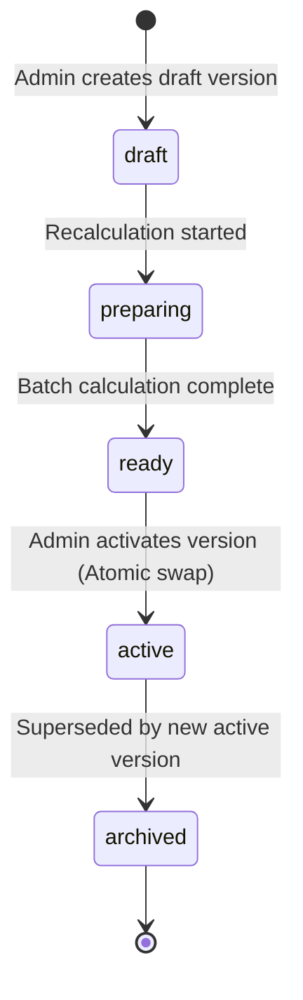

# Floria — Versioned Pricing Policy & Recalculation Engine (Phase 3.23)

## 1. Architecture Overview

Floria operates on a versioned, database-driven financial policy engine. Changes to platform economics (commission rates, profit margins, maintenance fees, free delivery recovery, and thresholds) are never applied as in-place destructive mutations. Instead, they follow an immutable versioning lifecycle.

---

## 2. Policy Version Lifecycle States

| State | Description | Next Allowed State |
|---|---|---|
| `draft` | Policy created with proposed parameters. Not yet applied to products. | `preparing` |
| `preparing` | Background recalculation job is running across active listings. | `ready`, `failed` |
| `ready` | All listing pricing read models calculated and verified. | `active` |
| `active` | Current production policy used for product discovery and new orders. | `archived` |
| `archived` | Superseded past version preserved for audit and historical linkage. | Terminal |
| `failed` | Recalculation encountered errors; requires admin retry or parameter update. | `draft`, `preparing` |

---

## 3. The Five Core Financial Parameters

1. **`seller_commission_rate`** (`NUMERIC(5, 2)`): Percentage deducted from seller entered base price (default `12.00%`).
2. **`floria_profit_rate`** (`NUMERIC(5, 2)`): Internal markup added during listing generation (default `2.00%`).
3. **`platform_maintenance_fee_paise`** (`BIGINT`): Charged once per checkout master order (default `1000` paise = ₹10.00).
4. **`free_delivery_threshold_paise`** (`BIGINT`): Per-product pre-recovery price threshold for free delivery eligibility (default `59900` paise = ₹599.00).
5. **`free_delivery_recovery_paise`** (`BIGINT`): Internal delivery recovery added to qualifying products (default `2000` paise = ₹20.00).

---

## 4. Product Pricing Read Model (`product_pricing`)

To eliminate runtime calculation latency at scale while guaranteeing absolute transparency, every policy version generates a read model:
- `policy_version_id` (UUID)
- `product_id` (UUID)
- `seller_id` (UUID)
- `seller_base_price_paise` (BIGINT)
- `floria_profit_paise` (BIGINT)
- `delivery_recovery_paise` (BIGINT)
- `customer_product_price_paise` (BIGINT)
- `is_free_delivery_eligible` (BOOLEAN)
- `seller_commission_paise` (BIGINT)
- `seller_net_paise` (BIGINT)
- `is_override` (BOOLEAN)

---

## 5. Historical Order Price Immutability Guarantee

Once an order is created:
1. `orders.subtotal_paise`, `orders.delivery_fee_paise`, `orders.maintenance_fee_paise`, and `orders.total_paise` are permanently locked.
2. `order_items` stores exact financial snapshots: `base_price_paise_snapshot`, `unit_price_paise_snapshot`, `floria_profit_paise_snapshot`, `delivery_recovery_paise_snapshot`, `commission_rate_snapshot`, `commission_paise_snapshot`.
3. Customer order tracking (`/orders` and `/orders/[id]`) and seller payout settlements strictly render historical snapshot columns.
4. Future policy version activations or admin overrides **never** retroactively recalculate existing orders.
